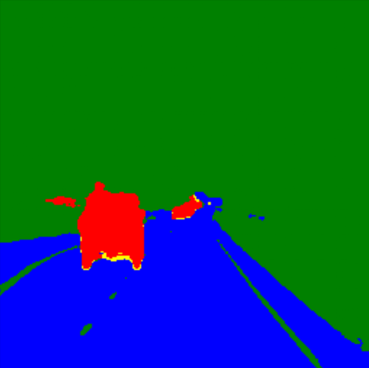

This Repo contains MoE architecture models, for: 
1.) Car 
2.) Road

-> These are the specialized models for these specific class, and they each are passed through a router mode: road_car_router
  passing in the image with the inference pipeline to only those class models that croses a minimum thresshold, and finally it combines the mask
  to create a multi-class model with great accuracy with respect to number of parameters and speed of whole inferencing time.

 

  

